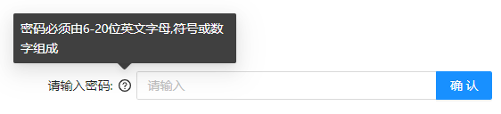

# QA
## 介绍
基于 React Hook + TypeScript + Ant Design 实现的 QA 组件
## 效果演示

## 组件划分
    1. App 组件
    2. QA 组件
    3. 使用了部分 Ant Design 已有的组件和矢量图标
## 下载
```js
git clone git@github.com:JavanCheng/QA.git
```

## 使用

```js
npm i
npm start
```